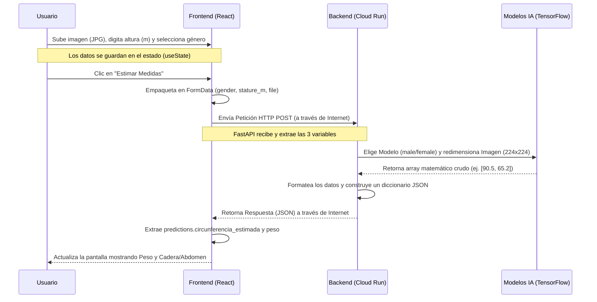

# Flujo de Arquitectura del Sistema

El siguiente diagrama ilustra el viaje completo de la información, desde el navegador del usuario hasta los servidores en la nube de Google y de regreso.

## Nube vs Local
* **Lo que interactúa el usuario (Frontend)**: Corre internamente en su propio navegador usando los recursos de su computadora/móvil (una vez descargada la web de Vercel/Firebase).
* **Lo que procesa los datos (Backend)**: Corre en la memoria de los servidores de **Google Cloud Run**. Allí se hace el trabajo pesado de analizar píxeles mediante las Redes Neuronales, liberando a la computadora del usuario de esta pesada carga computacional.
